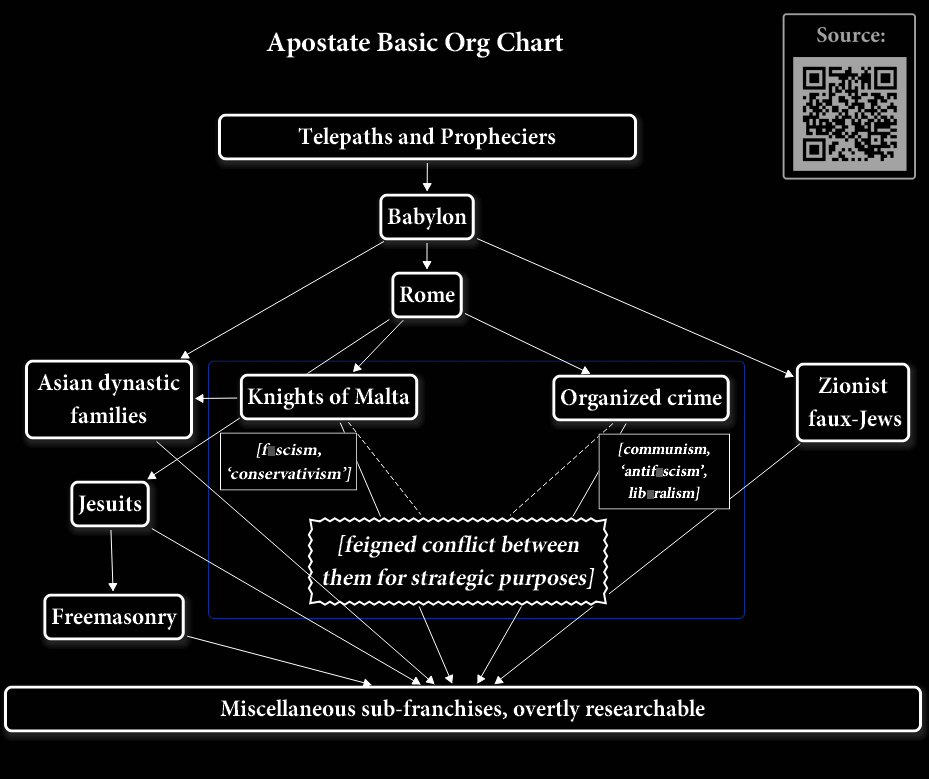

# About the Telepaths and Propheciers

In this basic org chart,

we can see an organizational 'layer' which is 'above' the Babylonian Kabbalists.  Addressing and resolving the oppression caused by the organization necessarily requires addressing the r██t of the problem, so we'll need to get into this part of it.

There is and presumably has always been a significant proportion of the human p█pulation which somehow has the capacity to read the minds of others even remotely, and the capacity to 'see ahead' into the future and know events well in advance.  I've only become aware of this due to their involvement with Myself, and for whatever reason they've made My life the subject, or vict█m, of their intensive scrutiny, and because they've been having a dialogue with Me via non-overt methods which has amply illustrated their capabilities.

Their psion█c capabilities have enabled them to know in advance at what media I would look, and when.  And control over an international criminal syndicate with its influence on just about everything has enabled them to retroactively 'revise' that media content to present non-overt symbolism relevant to Me at any given time, when they Choose.  That and their mind-reading capabilities has enabled them to present up-to-the-moment responses non-overtly in media, even media items that were made long ago.  If the results of their organizational activities weren't so abjectly in conflict with Divine Will, with their own True Nature, and with Divinely-conferred rights, it would be quite a fascinating and enjoyable experience.  As-is though, the counter-Divine Will and counter-True Nature basis they're on and the oppressive and criminal nature of their activities as an organization necessarily mean that since they've chucked out the basis for truth, legitimacy, credibility and trust that communication is only as valuable and worthwhile as the basis it's on.  That would currently be negligible, and in most instances negative.

In and of themselves these telepaths and propheciers don't appear to have an organization either overtly or non-overtly proper, in the sense that the other 'layers' of the organization do.  They're effectively a loose assemblage of individuals co-ordinating primarily via their psi█nic capabilities like a sort of telepathic intern█t.  That must be nice, and the flagrancy with which they're willing to encroach upon the privacy rights of their fellow man presents them as, again, no particular respectors of Divinely-conferred rights.  This would be consistent with the counter-Divine Will, counter-True Nature basis on which the organization as a whole has been demonstrably predicated.

It's not clear to Me how they got these capabilities.  It could be that a certain proportion of mankind has them innately; if so, it would make sense that the loose assemblage or even rogue individuals haven't 'outed themselves' to the rest of humanity.  The ultimate human surveillance n█twork, the ability to see events before they happen and an organization with the clout to take action in response presumably would preclude any of their number from defying the majority agenda.  If Scriptural information is accurate, and it has been with regard to the rest of the organizational str█cture, the apostate system receives its clout from the Christian 'Adversary' figure.  This would mean that their psion█c abilities came not naturally but rather were endowed by non-physical entities which are themselves on a counter-Divine Will, counter-True Nature basis.  That would certainly explain why they've been able to retain those capabilities despite continually supporting an organization acting in direct confl█ct with the Divine Will which imbues us with all our natural abilities.  It would also be consistent with the pattern I've been seeing of each 'layer' of the organization effectively working as an amplifier to the agendas of the 'layers' above it, in what military terminology refers to as a 'force mult█plier'.  I've also noticed Rome occasionally working with non-physical entities which are on a counter-Divine Will basis in order to promote its agendas; towns and even in our era individuals being terr█fied by supernatural inf█stations, only to have Roman Catholic priests intone in Latin and quell the problem has tended to be very strategically useful in acquiring new converts.  But as to how these telepaths and propheciers gained their abilities I can only sp█culate and theorize based on the available evidence.

It appears this loose assemblage founded the 'Babylonian Kabbalist' 'layer' as a sort of tangible organization through which to make their agendas very palpably f█lt.  The implied messaging via symbolism of the Babylonian Kabbalists is that the organization's *raison d'être* is to spread, promote and uphold Divine Will.  But a claim is only as credible and reliable as its basis, and the basis of evidence based on their activities plainly gainsays that.  Closer evaluation of the organizing symbols they use to imply and reference 'Divine Will' tends to instead have some rather unsavory counter-Divine Will meanings and etymologies, as we'll see when we examine their various symbols.

For obvious reasons the telepaths and propheciers tend not to use symbolism for their own 'layer' ordinarily for the most part, unless and except when they Choose to signal their presence as telepaths and propheciers to others.  In those instances there are a few 'reserved symbols' used within the apostate system for this (see [[Is█s]] for example), and with others like Myself their abilities to mention events they've already 'seen ahead' and to read minds enables them to make their status plain enough to someone through experiential evidence rather than organizing symbolism.  As such, this 'layer' of personnel cannot reliably be identified through symbolism alone, nor when they Choose not to make it known.

This makes justice and accountability problematic; they're able to enforce their own internal policies, but to everyone else and regarding everything else the accountability is lacking, at least pending direct Divine Intervention.  Fort█nately they appear to do most of their activities through the various franchise 'layers' of personnel from the Babylonian Kabbalists on down, and those can be recognized and brought to justice.  It does mean however that even fl█ttening out the whole organization would not be quite sufficient to solve the problem once and for all.  For that, the public themselves need to be not only familiar with Divine Will principles but also continuously uphold them collectively against all efforts to subvert that.  This is accounted for in My ***['A Better Solution'](http://DivineWillAssembly.com/2021/07/03/a-better-solution/)***.

I mention this upfr█nt because complete truthfulness requires presenting the whole situation.  For now with regard to sorting the apostate system we can safely focus on the organization from the Babylonian Kabbalists on down, and bringing the various 'amplifier' franchises to justice will sort the overwhelming majority of the problem.  But preventing its recurrence necessarily requires the People collectively and continuously upholding Divine Will principles, and given the organization's well-established propensity to deploy 'revisionist history' to subvert a People away from their foundations it seems to Me a very practical, if appropriately cynical, policy decision on My part to present this at the onset even before the public effort to resolve the problem acquires mom█ntum.  This keeps participants 'in the know' about what's involved and why.  That's just common sense.